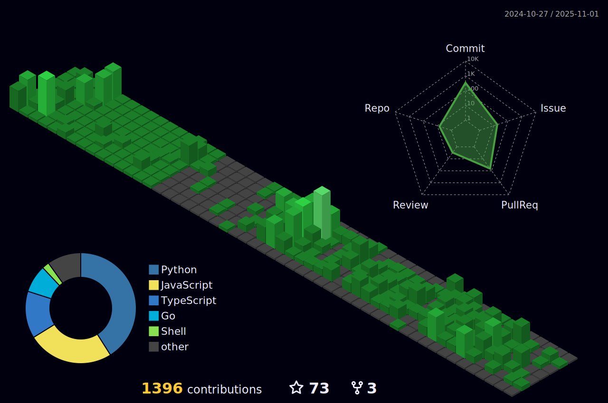

<!-- Don't just fork or copy it. Star it, please 🥺  -->

<!-- For Stat Check

  
-->

   

  
  
  
  
  
  
  

    &nbsp 
     &nbsp
    &nbsp
     
    &nbsp
    &nbsp
    &nbsp
  

  
  ### [📝 記憶より記録を](https://yuminnk-devlog.vercel.app/)
  
  [サイバーエージェント説明会(2)](https://yuminnk-devlog.vercel.app/%E8%AA%AC%E6%98%8E%E4%BC%9A2)  
[LaravelでADRパターンを適用： アプリケーション構造のモジュール化と保守性の向上](https://yuminnk-devlog.vercel.app/laraveladr%E9%81%A9%E7%94%A8-%E6%A7%8B%E9%80%A0%E5%8C%96%E4%BF%9D%E5%AE%88%E6%80%A7%E5%90%91%E4%B8%8A)  
[1日1コミット1年間の旅: 堅実さが成長につながった私の開発者の習慣](https://yuminnk-devlog.vercel.app/1%E6%97%A511%E5%B9%B4%E9%96%93%E6%97%85-%E5%A0%85%E5%AE%9F%E6%88%90%E9%95%B7%E7%A7%81%E9%96%8B%E7%99%BA%E8%80%85%E7%BF%92%E6%85%A3)  

